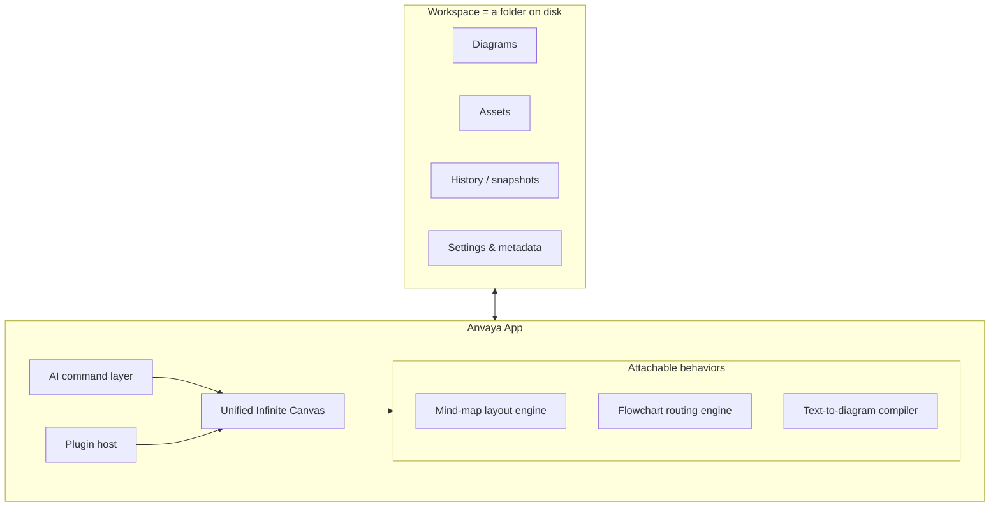
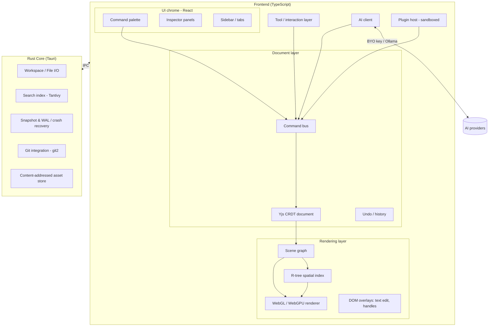
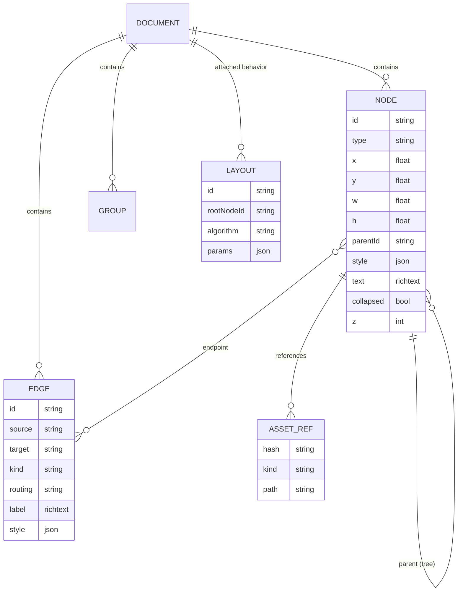
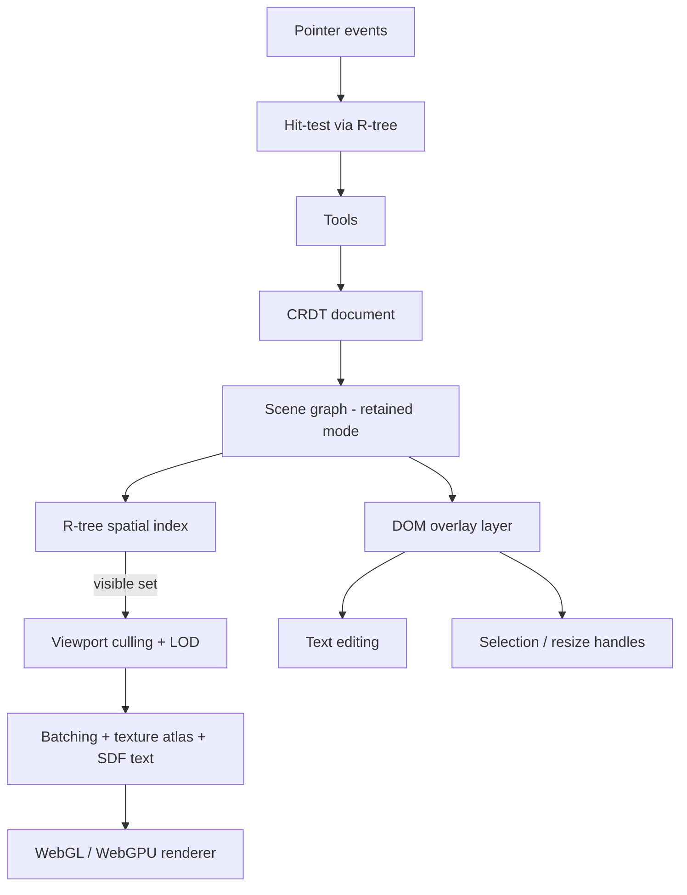
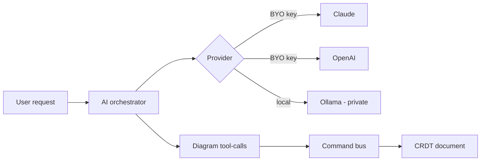
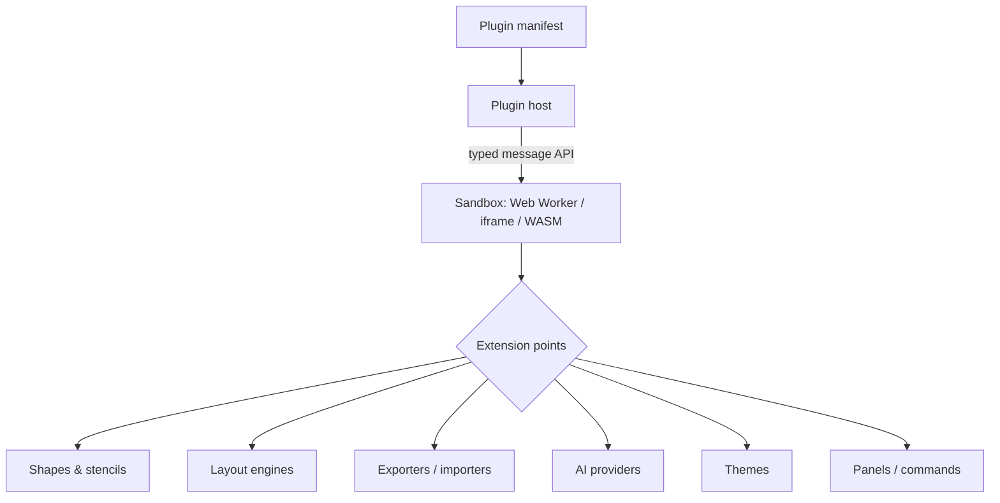
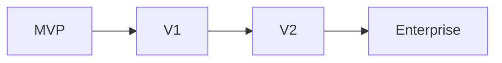

# Anvaya — Product & Technical Architecture

> **Anvaya (अन्वय)** — connection, relation, sequence, logical continuity.
> A premium, local-first visual thinking application that unifies **mind maps** and **flowcharts** on one infinite canvas.

This document is written from the perspective of a Principal Architect + Senior UX Designer + PM. It does **not** just implement the brief — it challenges several assumptions where I believe there is a better path. Every recommendation states the *why*.

---

## 0. TL;DR — The Seven Bets

If you take nothing else from this document, take these seven load-bearing decisions. Everything else follows from them.

| # | Bet | One-line rationale |
|---|-----|--------------------|
| 1 | **Tauri v2** (Rust core + system WebView), not Electron | Native-quality feel, ~10× smaller binaries, first-class local filesystem, real cross-platform path |
| 2 | **CRDT document model from day one** (Yjs) even for single-user | Undo, crash recovery, offline, and future real-time collab all fall out of one mechanism. Retrofitting collab later is brutal. |
| 3 | **WebGL/WebGPU retained-mode canvas** with spatial index + tiling, DOM only for editing overlays | Only architecture that hits "world-class canvas" *and* scale. Proven by Figma/Miro/tldraw. |
| 4 | **Human-readable JSON is the on-disk source of truth**; CRDT is the runtime layer | Git-diff-friendly *now*, collaboration-ready *later*, without picking one over the other |
| 5 | **One generic node/edge/shape engine + shape libraries + attachable layout behaviors** — not 12 bespoke editors | "Mind map" = a subtree with a layout engine attached. "BPMN" = a stencil library. Massive scope reduction. |
| 6 | **AI as a command layer**, not a parallel system | Every AI action produces normal diagram edits → undo, history, and collab work uniformly and for free |
| 7 | **Command-driven core**: every mutation is a Command | Palette, shortcuts, menus, plugins, and AI all dispatch the same commands → one code path to test |

---

## 1. Challenging Your Assumptions

You explicitly asked to be challenged. Here are the reframes I'd fight for before writing code.

### 1.1 "100,000+ nodes" is a benchmark, not a UX target
Human-authored diagrams almost never exceed a few thousand *meaningful* nodes; beyond that, comprehension collapses. 100k nodes appears in exactly one real scenario: **machine-generated diagrams** (imported ER schemas, code-derived architecture, log graphs).

**Reframe:** Design the *engine* to survive 100k (WebGL + spatial index + virtualization + LOD), but design the *product* for 2k–10k comfortable authoring, with 100k treated as a "view/import/navigate" mode, not an "edit-everything-at-60fps" mode. Don't let the 100k number distort MVP decisions.

### 1.2 "Mind maps + flowcharts on one canvas" hides a real interaction-model conflict
They are *not* the same tool with different shapes:
- **Mind maps** are keyboard-driven, auto-laid-out trees. You press Tab/Enter and the layout engine places everything. You almost never drag.
- **Flowcharts** are free placement + explicit connectors + routing. Dragging *is* the interaction.

If you naively merge them you get a tool that is mediocre at both. **The unifying primitive is the canvas + scene graph, not the interaction.** A mind map is a *container subtree with a layout engine bound to it*; a flowchart node is a free node. Both live in the same document, both can connect to each other via relationship edges. This "**layout engine as an attachable behavior**" idea (§6.4) is the single most important product design decision in the whole app.

### 1.3 "Enterprise diagramming" (BPMN + UML + AWS + Azure + K8s + ER + sequence + network) is 5+ products
Some of these are *freeform shape libraries* (AWS/Azure/K8s/network = stencils + connectors). But **sequence diagrams and ER diagrams are structurally different** — a sequence diagram is lifelines + ordered messages; an ER diagram is a schema. Building freeform editors for those is a trap.

**Reframe:** Support the structural diagrams via **text-to-diagram (Mermaid/DSL) that compiles into the same scene graph**, editable afterward. This gives you sequence/ER/state/gantt for a fraction of the cost, and it's *more* usable than dragging boxes for those types. Freeform stays for the diagrams where freeform wins.

### 1.4 "Local-first folder" and "real-time collaboration" are two different collaboration models
A folder on disk does not sync in real time. Real-time requires either a relay server or P2P transport. Git-merge and CRDT-merge are *different* merge philosophies. Trying to make one mechanism do both produces a leaky abstraction.

**Reframe:** Ship **two collaboration modes, clearly separated**: (a) *async collaboration via git* on the folder (works today, offline, no server), and (b) *real-time collaboration via a Yjs relay* as an opt-in "shared session," later. Both are backed by the same CRDT document, so they compose — but present them as distinct features, not one magic sync.

### 1.5 "AI as a core capability" collides with "local-first / private"
Cloud AI means your local-first, private diagrams leave the machine. That's a real trust problem for the exact developer audience you're targeting.

**Reframe:** AI is **pluggable and BYO-key** (Claude / OpenAI / local Ollama), off by default, with an explicit "what leaves the machine" disclosure per action. Local models (Ollama) for privacy-sensitive users. AI is an *augmentation layer that emits Commands* — never load-bearing for the core editing loop.

---

## 2. Product Architecture



**Product pillars**

1. **One canvas, many thinking modes** — brainstorm (mind map) → structure (flowchart) → document (notes/AI), without switching apps.
2. **Local-first & yours** — a workspace is a plain folder you own, back up, and version with git.
3. **Fast enough to disappear** — the canvas never stutters; the tool gets out of the way.
4. **Extensible** — shapes, diagram types, exporters, and AI are plugins, not core forks.
5. **AI as a thinking partner** — generate, restructure, critique, and document — always producing editable output.

---

## 3. Technical Architecture



**Key idea — the Command bus is the spine.** Tools, palette, keyboard, AI, and plugins *all* produce Commands. Commands mutate the CRDT document. The scene graph observes the CRDT and updates the renderer. This single path means undo/redo, history, collaboration, and testing each have exactly one thing to reason about.

---

## 4. Technology Stack

| Layer | Recommendation | Why (and what I rejected) |
|-------|----------------|---------------------------|
| **Shell** | **Tauri v2** | Rust backend, system WebView (WKWebView on macOS). ~3–10 MB binaries vs Electron's ~100 MB+, far lower memory, native menus/vibrancy, excellent FS/IPC. *Rejected Electron* (heavy, less native) and *native SwiftUI* (best feel but throws away cross-platform + web canvas ecosystem). |
| **Core language** | **Rust** (native side) | File I/O, search index, snapshots, git, asset hashing want a fast systems language. |
| **Frontend** | **TypeScript + React** | UI chrome only. React for panels/menus/palette; **not** for the canvas. |
| **Canvas render** | **WebGL** (via a thin custom layer or **PixiJS**), **WebGPU** where available, **Canvas2D** fallback | Only GPU paths scale to tens of thousands of objects at 60fps. WebGPU is the future; keep it behind a renderer interface. |
| **Document model** | **Yjs** (CRDT) | Best-in-class TS CRDT, huge ecosystem, awareness/presence built in, y-websocket/y-webrtc for later real-time. *Considered Automerge* (nicer persistence story, Rust core) — a legitimate alternative if you want the CRDT in Rust; Yjs wins on maturity + performance today. |
| **On-disk format** | **Normalized JSON** per diagram (deterministic serialization) | Human-readable, git-diffable. See §7. |
| **Search** | **Tantivy** (Rust) | Full-text search across the workspace, fast, embeddable. |
| **Git** | **git2 (libgit2)** in Rust | Version history without shelling out. |
| **Text-to-diagram** | **Mermaid** parser + custom DSL → scene graph | Cheap path to sequence/ER/state/gantt (§1.3). |
| **State (UI)** | **Zustand** or **Jotai** | Lightweight; the *real* state is the CRDT, so keep UI state minimal. |
| **Build** | Vite + Tauri CLI | Fast HMR for the web layer. |
| **Packaging** | Tauri bundler → **.dmg** (signed + notarized) | macOS first; Windows (.msi)/Linux (AppImage/deb) later with the same codebase. |

**Why Tauri over Electron, concretely:** your headline requirements are *local-first*, *native-quality macOS feel*, and *practical cross-platform*. Tauri optimizes exactly those: the Rust side owns the filesystem/workspace safely, binaries are tiny, startup is fast, and the same frontend later targets Windows/Linux. The one real cost — WebView inconsistency across platforms — is manageable because your heavy rendering is your *own* WebGL, not platform HTML.

---

## 5. Data Model

The document is a **flat, normalized scene graph** stored inside a Yjs document. Flat + keyed (not deeply nested) is what makes CRDT merges, partial updates, and spatial indexing efficient.



**Design notes**
- **Stable string IDs** everywhere (nanoid). No positional identity → CRDT-safe.
- **Nodes are flat**; tree structure is expressed via `parentId`, not nesting. A mind map is just nodes sharing a root plus an attached `LAYOUT`.
- **Positions**: for *free* nodes, `x/y` are authoritative. For *laid-out* nodes, position is *computed* by the layout engine and cached; the CRDT stores intent (order, parent), not the derived pixels. This avoids merge conflicts over auto-computed coordinates.
- **Rich text** as a CRDT sub-type (Yjs `Y.Text`) so text editing is collaborative and undoable at character granularity.
- **Style** is a token reference + overrides (theme-able, plugin-extensible), not raw hex everywhere.
- **Assets** are referenced by **content hash**, never embedded — keeps documents small and diffs clean (§7).
- **Extensibility**: `type` and `style` are open; plugins register new node/edge types + renderers without schema migration.

---

## 6. File Format & Workspace Design

### 6.1 Format decision

| Option | Readable | Git diff | Perf | Large diagrams | Collab | Verdict |
|--------|:-:|:-:|:-:|:-:|:-:|---|
| **JSON (normalized)** | ✅ | ✅ | ✅ | ✅ (sharded) | ⚠️ via CRDT layer | ✅ **Chosen (on-disk)** |
| YAML | ✅ | ✅ | ⚠️ | ⚠️ | ⚠️ | Anchors/parsing fragility |
| XML | ⚠️ | ⚠️ | ⚠️ | ⚠️ | ⚠️ | Verbose, legacy |
| SQLite | ❌ | ❌ | ✅ | ✅ | ❌ | Great DB, hostile to git |
| Binary/CRDT log | ❌ | ❌ | ✅ | ✅ | ✅ | Not human-diffable |

**Recommendation — a hybrid, but with a clear source of truth:**
- **On disk, the canonical format is normalized JSON**, one file per diagram, with *deterministic serialization* (sorted keys, stable array order, one logical record per line where practical) so git diffs are small and localized.
- **At runtime, Yjs (CRDT) is the mutation/undo/collab layer.** On save (debounced), the CRDT state is snapshotted to the canonical JSON. The reverse (JSON → CRDT) happens on open.
- **A binary CRDT update log** lives in `.anvaya/history/` for fine-grained version history, crash recovery, and (later) real-time sync. It's an *accelerator*, not the source of truth — safe to delete.

This resolves the tension you flagged: you get **git-diff-friendliness now** and **collaboration-readiness later** without choosing one.

### 6.2 Folder structure

```
MyWorkspace/
├── anvaya.workspace.json        # workspace manifest (name, version, settings ref)
├── diagrams/
│   ├── product-roadmap.anvaya    # a diagram = normalized JSON
│   └── auth-flow.anvaya
├── assets/
│   ├── images/
│   │   └── a1b2c3…f9.png          # content-addressed (hash filename)
│   └── attachments/
│       └── d4e5f6…a2.pdf
├── settings/
│   ├── theme.json
│   └── shortcuts.json
├── metadata/
│   └── tags.json                 # cross-diagram tags, links
└── .anvaya/                      # app-managed, git-ignorable
    ├── history/                  # CRDT update logs + snapshots
    ├── recovery/                 # WAL for crash recovery
    ├── index/                    # Tantivy search index
    └── cache/                    # thumbnails, render caches
```

**Rationale**
- `.anvaya/` holds everything derived/recoverable → add to `.gitignore`; the workspace stays clean in version control.
- **Content-addressed assets** (git-style) mean the same image is stored once, references are stable, and diagrams never bloat with base64. Recommend documenting **git-lfs** for large binaries.
- One diagram per file → parallel-friendly, small blast radius on merge, easy sharing (send one `.anvaya` file).
- `.anvaya` (not `.zip`) as extension so double-click opens in the app, but the file is plain JSON inside.

### 6.3 Auto-save, crash recovery, version history

- **Auto-save:** debounced (e.g. 500ms idle / 5s max) snapshot of CRDT → canonical JSON. No Save button, as required.
- **Crash recovery:** every mutation appends to a **write-ahead log (WAL)** in `.anvaya/recovery/`. On launch after a crash, replay the WAL over the last snapshot. Recovery is *guaranteed to the last op*, not the last save.
- **Undo history:** the CRDT's own undo manager (per-user, scoped) — free, and correct under collaboration.
- **Version history / snapshots:** periodic named snapshots + optional **git commits** (auto-commit on close, or user-triggered). Time-travel UI reads snapshots; "restore" is a new commit, never a destructive overwrite.
- **Backup:** because it's a folder, any file backup (Time Machine, Dropbox, git remote) just works.

### 6.4 The layout-engine-as-behavior model (key design)

A `LAYOUT` record attaches an algorithm to a subtree root. The layout engine is a *pure function*: `(nodes, params) → positions`. This is why mind maps and flowcharts coexist cleanly:
- Attach a `radial` layout to a subtree → it's a mind map.
- Attach no layout, place freely, add routed edges → it's a flowchart.
- A flowchart node can point a relationship edge at a mind-map node — they're all just nodes.

Layout engines are pluggable (§11), so "org chart," "timeline," and "fishbone" are additional layout plugins, not new editors.

---

## 7. Rendering Architecture

The hardest, most differentiating part. Approach modeled on Figma/Miro/tldraw: **bulk content on the GPU, interactive editing in the DOM.**



**Techniques**
- **Retained-mode scene graph** — the renderer owns a persistent object graph, re-rendering only what changed (dirty tracking), not the whole canvas each frame.
- **R-tree spatial index** — O(log n) hit-testing and viewport culling. This is what makes 100k objects navigable: you only touch what's on screen.
- **Viewport virtualization + tiling** — render visible tiles; cache off-screen tiles as textures.
- **Level of Detail (LOD)** — when zoomed out, draw simplified proxies (a rectangle instead of full text/shadows). Below a pixel threshold, cluster into a single glyph.
- **Text is the hard part** — use **SDF (signed-distance-field) glyph atlases** for crisp text at any zoom on Retina; cache rendered text runs. This is where naive canvas engines fall over.
- **Hybrid DOM overlay** — active text editing, selection handles, and context menus are real DOM (accessible, native input, IME support) positioned over the GPU canvas. You render *thousands* in WebGL but edit *one* in the DOM.
- **Retina/HiDPI** — render at device pixel ratio; SDF text stays sharp.
- **Smooth pan/zoom** — transform the camera (view matrix), never re-layout objects. Momentum/inertia scrolling for a native feel.
- **Renderer interface** — WebGL now, WebGPU behind the same interface, Canvas2D fallback for old machines. Never let render calls leak into app logic.

**MVP shortcut:** for the first release, **PixiJS (WebGL)** gives you batching, texture atlases, and a scene graph out of the box — ship on that, keep the renderer interface clean, and swap in a custom WebGPU engine later only if profiling demands it.

---

## 8. Editing Experience

All of these dispatch **Commands** (§3), so they compose and undo uniformly.

- **Smart connectors & auto-routing** — connectors attach to *ports* or float to the nearest edge; orthogonal/curved routing avoids overlaps (A*/orthogonal routing over an obstacle grid).
- **Snap lines & alignment guides** — snap to edges/centers/spacing of nearby objects; smart "equal spacing" hints.
- **Auto layout** — the layout-as-behavior engine (§6.4); reflows mind maps and can tidy flowcharts on demand.
- **Multi-select, drag & drop, resize handles, rotation.**
- **Grouping, layers, locking** — groups are container nodes; layers are z-ordered bands; lock sets an immutable flag honored by tools.
- **Folding/collapsing** — collapse a subtree (mind map) or a group; collapsed state lives in the node.
- **Smart text editing** — inline rich text, markdown shortcuts (`# `, `- `, `**`), auto-grow nodes.
- **Node duplication, smart paste** (paste an image → asset; paste a URL → link node; paste markdown → node tree).
- **Search** — Tantivy-backed, across the whole workspace, jump-to-node.
- **Command palette** (⌘K) — every command, fuzzy-searchable; the discoverability backbone.
- **Keyboard-first mind mapping** — Tab = child, Enter = sibling, arrows to navigate, so you can build a tree without the mouse.

---

## 9. Mind Map Features

Match/exceed dedicated tools. Layouts are plugins (§6.4).

- **Layouts:** radial, left/right, org chart, tree (down/up), timeline, fishbone, logic (brace), matrix.
- **Structure:** floating topics, callouts, boundaries/groups, summary nodes, cross-topic **relationship** edges.
- **Rich content:** icons, stickers, tags, notes (long-form), hyperlinks, attachments, embedded images/PDFs, math, code blocks.
- **Semantics:** progress indicators (%/checkbox), priority/flag markers, task metadata (assignee, due date) → enables a **task/outline view**.
- **Views of the same data:** outline view ↔ mind map ↔ presentation (walk the tree as slides).
- **Suggested additions:** *focus/zen mode* (isolate a branch), *quick capture* (global hotkey → new node), *style brush* (copy formatting), *topic templates*, *AI branch expansion* ("expand this idea into 5 children").

---

## 10. Flowchart & Diagramming Features

Per §1.3, split by structure:

**Freeform (drag + connectors + stencils):** basic flowcharts, BPMN, network, AWS / Azure / GCP / Kubernetes architecture, org charts — all delivered as **shape/stencil libraries + connector routing + light validation**, not separate editors.

**Structured (text/DSL → diagram):** sequence, ER/database, UML class, state machines, gantt — authored via **Mermaid/DSL that compiles into the scene graph**, then editable on-canvas. Far more usable for these types than dragging boxes.

- **Shape libraries** are versioned plugins with SVG/parametric shapes, ports, and metadata.
- **Additional libraries worth supporting:** C4 model, wireframe/UI kit, flowchart+swimlanes, mindmap-to-flowchart converter, iconography packs (Simple Icons, cloud provider official sets).
- **Validation as plugins:** BPMN/UML validators flag structural errors without blocking freeform use.

---

## 11. AI Architecture

AI emits **Commands**, so its output is normal, editable, undoable diagram content.



- **Provider-agnostic, BYO-key, off by default.** Local **Ollama** option for privacy. Per-action disclosure of "what leaves your machine" (§1.5).
- **Structured tool-calling**, not free-text-then-parse: the model calls `createNode`, `connect`, `applyLayout`, etc. → validated Commands. This is where the latest Claude models (strong tool use) shine.
- **Workflows:** NL → diagram; markdown → diagram; **code → architecture diagram**; explain/summarize a diagram; critique & improve; detect inconsistencies (dangling connectors, unreachable states); generate docs; diagram → slides.
- **Suggested additions:** semantic search ("find where I discussed auth"), auto-tagging, layout suggestions, "clean up this messy diagram," meeting-notes → mind map, diff explanation ("what changed since last week").
- **Guardrails:** AI operations are previewable and undoable as a single Command; nothing is applied silently.

> ℹ️ When you implement the AI client, load the `claude-api` skill for current Claude model IDs, pricing, tool-use, and caching — don't hardcode model names from memory.

---

## 12. Collaboration Architecture

Two clearly-separated modes over one CRDT (§1.4).

| Mode | Transport | When | Merge model |
|------|-----------|------|-------------|
| **Async / git** | Files + git | Default, offline, no server | Normalized JSON diffs; conflicts resolved via CRDT-aware merge driver |
| **Real-time** | Yjs + WebSocket relay (or WebRTC P2P) | Opt-in "shared session" | CRDT auto-merge, live presence/cursors |

- **Because the document is already a CRDT**, real-time is *additive* — same document, new transport. No rewrite.
- **Git merge friendliness:** ship a custom **git merge driver** that merges two `.anvaya` JSONs via the CRDT rather than line-by-line, so structural merges "just work."
- **Comments & presence:** comments are first-class nodes anchored to targets; presence/cursors via Yjs awareness.
- **Branches:** git branches for async; named CRDT versions for in-app history.
- **Enterprise later:** self-hosted relay + auth for teams that can't use P2P.

---

## 13. Performance & Scalability

- **Data structures:** flat keyed maps for nodes/edges (O(1) access); **R-tree** for spatial queries; incremental/dirty layout (recompute only affected subtrees).
- **Rendering:** culling + tiling + LOD + batching + SDF text (§7). Target: 60fps pan/zoom with 10k visible; navigable at 100k.
- **Off-main-thread:** run layout, search indexing, and CRDT diffing in **Web Workers / WASM**; keep the main thread for interaction.
- **Large assets:** stream images/PDFs, render thumbnails/proxies, load full-res lazily on zoom.
- **Memory:** virtualize — never hold full render state for off-screen tiles; evict caches under pressure.
- **Startup:** open the visible viewport first, hydrate the rest progressively.

---

## 14. Plugin Architecture

Capability-based, sandboxed, versioned.



- **Sandboxed execution** (Worker/iframe/WASM) — third-party code can't touch the filesystem or DOM directly; it talks to the host via a **typed, versioned message API**.
- **Extension points:** shape/stencil registration, layout engines, exporters/importers, AI providers, themes, commands, side panels, validators.
- **Declarative-first:** many "plugins" are pure data (stencil JSON, theme tokens) — no code, no risk. Reserve code plugins for behavior.
- **Capabilities & permissions:** a plugin declares what it needs (network, read selection, add nodes); the user grants them — the same trust model that keeps local-first *safe*.
- **Marketplace later:** signing + review for a public ecosystem.

---

## 15. UI Architecture

Premium macOS feel via Tauri native affordances + a disciplined React chrome.

- **Window:** native traffic-light, vibrancy/blur, native menu bar, native context menus where possible.
- **Navigation:** tabbed diagrams, a workspace **sidebar** (file tree, tags, search), collapsible **inspector** (properties of the selection), and a **mini-map**.
- **Command palette (⌘K)** as the central nervous system — search commands, diagrams, nodes, and AI actions in one place.
- **Inspector panels** bind to selection; plugin panels dock here.
- **Keyboard shortcuts** fully remappable (`settings/shortcuts.json`); mind-map keys are first-class.
- **Search experience:** instant, workspace-wide (Tantivy), jump-to-node, filter by tag/type.
- **Theming:** token-based, light/dark, plugin themes.
- **State discipline:** the CRDT is the truth; React state is only ephemeral UI (open panels, hover). This avoids the classic "two sources of truth" bug class.

---

## 16. Phased Roadmap



### MVP (prove the core loop)
Single-user. Tauri + React + **PixiJS** canvas. One infinite canvas hosting **mind maps** (radial + left/right, keyboard-driven) and **basic flowcharts** (nodes + routed connectors). Yjs document, WAL crash recovery, auto-save to normalized JSON, undo/redo, command palette, multi-select, snap/align, export PNG/SVG. Signed & notarized **.dmg**.
*Goal: the unified canvas feels great for one person.*

### v1 (make it a product)
WebGL scaling (spatial index, culling, LOD, SDF text). More layouts (org/tree/timeline/fishbone). Shape/stencil libraries. Text-to-diagram (Mermaid) for sequence/ER. Git-based version history + time travel. AI (NL→diagram, code→diagram, BYO key) via Command tool-calls. Plugin API v0 (declarative shapes + exporters). Tags, notes, attachments, search.

### v2 (collaborate & extend)
Real-time collaboration (Yjs relay), presence, comments. Full plugin SDK (code plugins, AI providers, layout engines). Advanced AI workflows (critique, docs, diagram→slides). **Windows & Linux** builds. Plugin marketplace (beta).

### Enterprise
Self-hosted sync/relay, SSO/SAML, team shape libraries, audit logs, permissions/roles, on-prem AI, admin console, compliance.

---

## 17. Risks & Trade-offs

| Risk | Impact | Mitigation |
|------|--------|-----------|
| **Scope explosion** (12 diagram types + AI + collab + plugins) | Never ship | The §1 reframes: one engine + libraries; text-to-diagram for structural types; ruthless MVP |
| **Canvas engine underestimation** | The whole app feels cheap | Start on PixiJS behind a renderer interface; invest in SDF text early; profile against real 10k-node docs |
| **CRDT ↔ readable-JSON reconciliation** | Diff-friendliness or collab breaks | Canonical JSON is source of truth; CRDT log is an accelerator; custom git merge driver; deterministic serialization |
| **WebView inconsistency** (Tauri) across OSes | Cross-platform bugs | Heavy rendering is your own WebGL, not platform HTML; test WKWebView/WebView2/WebKitGTK in CI |
| **AI vs local-first privacy** | Trust loss with dev audience | BYO-key, off by default, Ollama option, per-action disclosure |
| **Real-time collab complexity** | Time sink, ops burden | Defer to v2; async/git first; same CRDT so it's additive |
| **Plugin security** | Malicious third-party code | Sandbox + capability permissions + signing; declarative-first |
| **"100k nodes" over-optimization** | MVP delayed for a rare case | Engine survives 100k; product targets 10k; don't gold-plate MVP |
| **Text-to-diagram round-trip** (edit-after-generate diverges from source) | Confusing UX | Decide per type whether the DSL or the canvas is the source of truth; show it clearly |

---

## 18. Where I Recommend Something Better Than the Brief

1. **Tauri, not Electron** — you'll get closer to "premium macOS" *and* a smaller, faster app, *and* keep cross-platform.
2. **CRDT from day one** — you asked for collab "eventually"; adopting Yjs now makes undo/recovery/offline/collab one mechanism instead of a future rewrite.
3. **One engine + libraries + layout-as-behavior** — instead of building mind-map and flowchart (and BPMN, UML…) editors, build a generic scene graph with attachable layouts and stencil libraries. This is the biggest scope win in the document.
4. **Text-to-diagram for structural types** — sequence/ER/state/gantt via Mermaid/DSL beats freeform editors on both cost and usability.
5. **Two explicit collaboration modes** — async-git and real-time-CRDT, not one magical "sync."
6. **AI as a Command layer, BYO-key, local option** — keeps AI powerful *and* respects your local-first promise.
7. **Treat 100k nodes as an engine benchmark, not a product target** — design for it, don't let it dictate the MVP.

---

*This is a living design. The recommended next step is to validate the two riskiest bets with throwaway spikes: (a) a PixiJS canvas rendering ~10k nodes with pan/zoom + SDF text, and (b) a Yjs document snapshotting to normalized JSON with a clean git diff. If both feel right, the rest of the architecture follows.*
